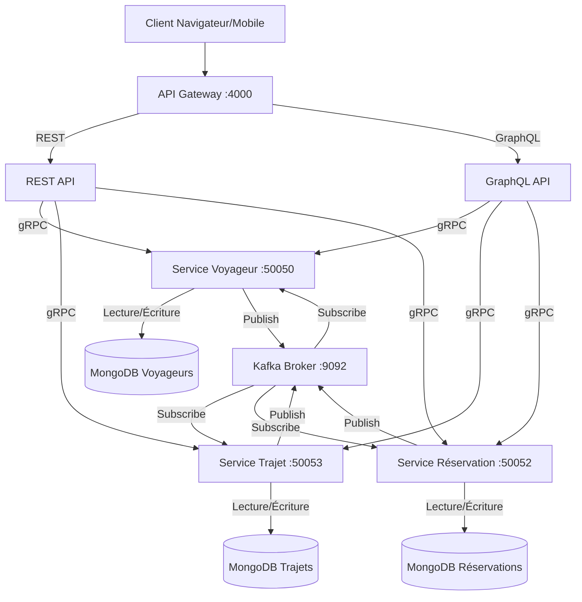
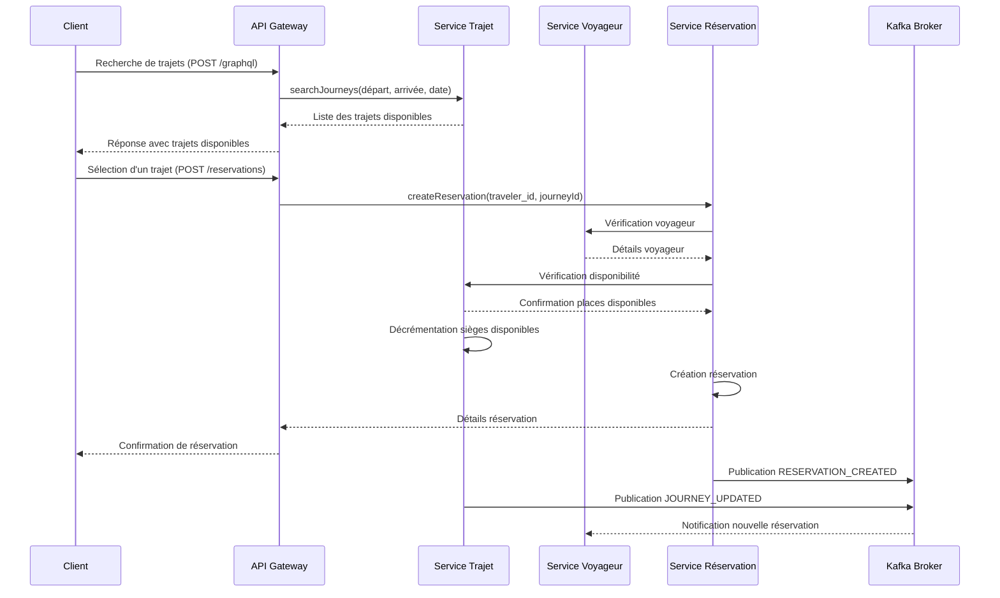

# ✈️ SkyConnect - Plateforme de Réservation de Trajets Microservices

**Auteur**: Naïma Rejeb

## 📌 Vue d'ensemble

SkyConnect est une plateforme moderne de réservation de trajets aériens construite sur une **architecture orientée microservices**. Elle permet aux voyageurs de rechercher, comparer et réserver des trajets avec une expérience utilisateur optimisée. L'architecture distribuée combine REST, GraphQL, gRPC et Kafka pour une solution robuste et évolutive.

---

## 🏢 Architecture

L'application suit une architecture orientée microservices avec les composants suivants:

1. **Service Voyageur** - Gestion des profils voyageurs et préférences de voyage
2. **Service Trajets** - Gestion des informations de trajets, disponibilité et tarifs
3. **Service Réservation** - Gestion du processus de réservation et des transactions

Les services communiquent via **gRPC** pour les opérations synchrones et **Kafka** pour la communication asynchrone basée sur les événements. Une **API Gateway** unifie l'accès via REST et GraphQL.

### Diagramme d'architecture



### Améliorations récentes

- **Système d'ID cohérent** : Implémentation d'un système où les champs `journeyId` et `id` sont utilisés de manière cohérente dans tous les services pour une meilleure traçabilité
- **Double API**: Interface REST pour les opérations CRUD simples et GraphQL pour les requêtes complexes
- **Validation des données**: Contrôles stricts sur les préférences des voyageurs et les champs obligatoires
- **Communication événementielle**: Notification en temps réel des changements via Kafka

## 💻 Fonctionnalités principales

- **Recherche avancée de trajets** avec filtres sur les compagnies, prix, classe de cabine
- **Profils voyageurs enrichis** avec préférences de siège et de repas
- **Gestion complète des réservations** incluant paiement, sélection de siège et bagages
- **Suivi en temps réel** du statut des trajets
- **Statistiques et analytics** sur les routes populaires et tendances de réservation

## 🌐 Points d'entrée API

### 🔹 GraphQL 
- **URL**: `http://localhost:4000/graphql`
- **Requêtes principales**:
  - Recherche de trajets: `searchJourneys(departure, arrival, departureDate, passengers, cabinClass)`
  - Détails de réservation: `reservation(status)`, `reservationsByTraveler(travelerId)`
  - Création de réservation: `CreateReservation(travelerId, journeyId, passengersCount, totalPrice)`
  - Gestion des paiements: `updatePaymentInfo(id, paymentInfo)`

### 🔹 REST API
- `GET /journeys/search?departure=Paris&arrival=London&departureDate=2025-06-01`
- `POST /travelers` - Création d'un compte voyageur
- `POST /reservations` - Création d'une réservation
- `PUT /journeys/:id` - Mise à jour des disponibilités
- `DELETE /reservations/:id` - Annulation d'une réservation

## 📂 Structure de données

### Voyageurs
- Profil complet: nom, email, téléphone
- Préférences de voyage: siège, repas, notifications
- Historique des trajets et fidélité

### Trajets
- Informations détaillées: compagnie aérienne, appareil, horaires
- Gestion des escales et connexions
- Classes de cabine et services disponibles
- Statut du trajet en temps réel

### Réservations
- Processus multi-étapes: sélection, paiement, confirmation
- Gestion des statuts: confirmation, enregistrement, embarquement
- Informations de paiement sécurisées
- Sélection de services additionnels

### Diagramme de séquence - Processus de réservation



## 💻 Technologies utilisées

- **Backend**: Node.js, Express.js
- **API**: Apollo Server (GraphQL), Express Routes (REST)
- **Communication**: gRPC (inter-services), Kafka (messaging asynchrone)
- **Stockage**: MongoDB (données structurées)
- **Outils**: Mongoose (ODM), body-parser, cors

### Configuration des ports

Le projet utilise la configuration de ports suivante pour les différents services :

| Service | Port |
|---------|------|
| API Gateway (REST & GraphQL) | 4000 |
| TravelerMicroservice | 50050 |
| JourneyMicroservice | 50053 |
| ReservationMicroservice | 50052 |
| Kafka | 9092 |
| MongoDB | 27017 |

## 🚩 Guide d'installation et d'exécution (A à Z)

### 1. Prérequis

#### Installation des dépendances système

- **Node.js** (v14 ou supérieur): Téléchargez et installez depuis [nodejs.org](https://nodejs.org/)
- **MongoDB Community Edition**:
  - Téléchargez depuis [mongodb.com](https://www.mongodb.com/try/download/community)
  - Installez en suivant les instructions pour votre système d'exploitation
  - Vérifiez que le service MongoDB est démarré: `sc query MongoDB`

#### Configuration de Kafka

1. **Télécharger Kafka**:
   - Téléchargez Apache Kafka depuis [kafka.apache.org](https://kafka.apache.org/downloads)
   - Extrayez l'archive dans un dossier (par exemple `C:\kafka`)

2. **Démarrer Zookeeper** (dans un terminal):
   ```bash
   cd C:\kafka
   .\bin\windows\zookeeper-server-start.bat .\config\zookeeper.properties
   ```

3. **Démarrer Kafka** (dans un nouveau terminal):
   ```bash
   cd C:\kafka
   .\bin\windows\kafka-server-start.bat .\config\server.properties
   ```

4. **Créer le topic Kafka** (dans un nouveau terminal):
   ```bash
   cd C:\kafka
   .\bin\windows\kafka-topics.bat --create --topic bookings --bootstrap-server localhost:9092 --partitions 1 --replication-factor 1
   ```

5. **Vérifier que le topic a été créé**:
   ```bash
   .\bin\windows\kafka-topics.bat --list --bootstrap-server localhost:9092
   ```
   Vous devriez voir `bookings` dans la liste des topics.

### 2. Installation du projet

1. **Cloner le projet** (si ce n'est pas déjà fait):
   ```bash
   git clone <URL-du-repo> SkyConnect
   cd SkyConnect
   ```

2. **Installer les dépendances**:
   ```bash
   npm install
   ```
   Cette commande installera toutes les dépendances listées dans package.json, y compris:
   - @apollo/server (GraphQL)
   - @grpc/grpc-js et @grpc/proto-loader (gRPC)
   - mongoose (MongoDB ODM)
   - express (API REST)
   - kafkajs (communication Kafka)

### 3. Démarrage des services (dans l'ordre)

> ⚠️ **Important**: Assurez-vous que MongoDB et Kafka sont en cours d'exécution avant de démarrer les services.

1. **Démarrer les microservices** (dans des terminaux séparés):

   **Service Voyageur**:
   ```bash
   cd Microservices
   nodemon TravelerMicroservice.js
   ```
   *Attendez le message de confirmation: "Serveur Traveler en écoute sur le port 50054"*

   **Service Trajet**:
   ```bash
   cd Microservices
   nodemon JourneyMicroservice.js
   ```
   *Attendez le message de confirmation: "Serveur Journey en écoute sur le port 50053"*

   **Service Réservation**:
   ```bash
   cd Microservices
   nodemon ReservationMicroservice.js
   ```
   *Attendez le message de confirmation: "Serveur Reservation en écoute sur le port 50052"*

2. **Démarrer l'API Gateway** (dans un nouveau terminal):
   ```bash
   nodemon GatewayApi.js
   ```
   *Attendez le message de confirmation: "🚀 Server ready at http://localhost:4000/graphql"*

3. **Vérifier que tout fonctionne** en ouvrant:
   - GraphQL Playground: [http://localhost:4000/graphql](http://localhost:4000/graphql)
   - Vous pouvez tester l'API REST avec Postman ou un navigateur: [http://localhost:4000/users](http://localhost:4000/users)

## 🔍 Guide complet des tests (gRPC, GraphQL, REST, Kafka)

### 1. Initialisation de la base de données avec des exemples

Pour pouvoir tester le système, vous devez d'abord créer quelques données initiales. Vous pouvez utiliser le script FakerDb.js pour générer des données d'échantillon:

```bash
node FakerDb.js
```

### 2. Tests REST API (avec Postman)

#### Test des voyageurs

1. **Récupérer tous les voyageurs**:
   - Méthode: `GET`
   - URL: `http://localhost:4000/travelers`
   - Résultat attendu: Liste des voyageurs au format JSON

2. **Créer un nouveau voyageur**:
   - Méthode: `POST`
   - URL: `http://localhost:4000/travelers`
   - Headers: `Content-Type: application/json`
   - Body:
     ```json
     {
       "name": "Marie Dupont",
       "email": "marie@example.com",
       "phoneNumber": "+33612345678",
       "preferences": {
         "seatPreference": "window",
         "mealPreference": "vegetarian",
         "notificationEnabled": true
       }
     }
     ```
   - Résultat attendu: Voyageur créé avec ID

#### Test des trajets

1. **Récupérer tous les trajets**:
   - Méthode: `GET`
   - URL: `http://localhost:4000/journeys`
   - Résultat attendu: Liste des trajets au format JSON

2. **Recherche de trajets**:
   - Méthode: `GET`
   - URL: `http://localhost:4000/journeys/search?departure=Paris&arrival=London&departureDate=2025-06-01`
   - Résultat attendu: Liste des trajets correspondants aux critères

3. **Mise à jour des sièges disponibles**:
   - Méthode: `PUT`
   - URL: `http://localhost:4000/journeys/:id` (remplacez `:id` par un ID réel de trajet)
   - Headers: `Content-Type: application/json`
   - Body:
     ```json
     {
       "seatsChange": -2
     }
     ```
   - Résultat attendu: Trajet mis à jour avec nombre de sièges décrémenté

#### Test des réservations

1. **Récupérer toutes les réservations**:
   - Méthode: `GET`
   - URL: `http://localhost:4000/reservations`
   - Résultat attendu: Liste des réservations au format JSON

2. **Créer une réservation**:
   - Méthode: `POST`
   - URL: `http://localhost:4000/reservations`
   - Headers: `Content-Type: application/json`
   - Body:
     ```json
     {
       "travelerId": "[ID_VOYAGEUR]",
       "journeyId": "[ID_TRAJET]",
       "passengersCount": 2,
       "totalPrice": 450.50,
       "contactEmail": "contact@example.com",
       "contactPhone": "+33612345678"
     }
     ```
   - Résultat attendu: Réservation créée avec ID et statut "pending"

3. **Annuler une réservation**:
   - Méthode: `DELETE`
   - URL: `http://localhost:4000/reservations/:id` (remplacez `:id` par un ID réel de réservation)
   - Résultat attendu: Message de confirmation et événement Kafka généré

### 3. Tests GraphQL (via GraphQL Playground)

#### Requêtes de base

1. **Récupérer tous les voyageurs**:
   ```graphql
   query {
     travelers {
       id
       name
       email
       phoneNumber
       preferences {
         seatPreference
         mealPreference
         notificationEnabled
       }
     }
   }
   ```

2. **Récupérer tous les trajets**:
   ```graphql
   query {
     journeys {
       id
       journeyNumber
       airline
       departure
       arrival
       departureTime
       arrivalTime
       duration
       price
       availableSeats
       cabinClass
       status
     }
   }
   ```

3. **Récupérer les réservations par statut**:
   ```graphql
   query {
     reservation(status: "pending") {
       id
       travelerId
       journeyId
       status
       totalPrice
       reservationDate
       passengersCount
       contactEmail
     }
   }
   ```

#### Mutations

1. **Créer un voyageur**:
   ```graphql
   mutation {
     createTraveler(
       name: "Jean Martin"
       email: "jean@example.com"
       phoneNumber: "+33612345678"
       preferences: {
         seatPreference: "aisle"
         mealPreference: "regular"
         notificationEnabled: true
       }
     ) {
       id
       name
       email
     }
   }
   ```

2. **Créer une réservation**:
   ```graphql
   mutation {
     CreateReservation(
       travelerId: "[ID_VOYAGEUR]"
       journeyId: "[ID_TRAJET]"
       passengersCount: 1
       totalPrice: 350.75
       contactEmail: "contact@example.com"
       contactPhone: "+33612345678"
     ) {
       id
       status
       reservationDate
     }
   }
   ```

3. **Annuler une réservation**:
   ```graphql
   mutation {
     cancelReservation(id: "[ID_RESERVATION]")
   }
   ```

4. **Mettre à jour les sièges d'un trajet**:
   ```graphql
   mutation {
     updateJourneySeats(id: "[ID_TRAJET]", seatsChange: -1) {
       id
       journeyNumber
       availableSeats
     }
   }
   ```

5. **Mettre à jour le statut d'un trajet**:
   ```graphql
   mutation {
     updateJourneyStatus(id: "[ID_TRAJET]", status: "delayed") {
       id
       journeyNumber
       status
     }
   }
   ```

### 4. Tests gRPC (communication entre services)

Les appels gRPC sont intégrés dans les microservices et sont exécutés automatiquement lorsque vous utilisez les APIs REST ou GraphQL. Pour visualiser les appels gRPC, observez les logs des microservices dans les terminaux.

Pour tester manuellement les services gRPC, vous pouvez utiliser l'outil [BloomRPC](https://github.com/uw-labs/bloomrpc) ou [gRPCurl](https://github.com/fullstorydev/grpcurl).

Exemples d'utilisation de gRPCurl pour tester les services:

**Service Voyageur:**
```bash
grpcurl -plaintext -import-path ./Protos -proto Traveler.proto localhost:50054 traveler.TravelerService/ListAllTravelers
```

**Service Trajet:**
```bash
grpcurl -plaintext -import-path ./Protos -proto Journey.proto localhost:50053 journey.JourneyService/ListAllJourneys
```

**Service Réservation:**
```bash
grpcurl -plaintext -import-path ./Protos -proto Reservation.proto localhost:50052 reservation.ReservationService/ListAllReservations
```

### 5. Test de la communication Kafka

1. **Démarrer un consommateur Kafka** pour observer les messages:
   ```bash
   cd C:\kafka
   .\bin\windows\kafka-console-consumer.bat --bootstrap-server localhost:9092 --topic bookings --from-beginning
   ```

2. **Générer des événements** en effectuant des opérations qui produisent des messages Kafka:
   - Créer un utilisateur via l'API REST: `POST /users`
   - Modifier un vol: `PUT /flights/:id`
   - Annuler une réservation: `DELETE /bookings/:id`

3. **Observer les messages** dans la console du consommateur Kafka.
   Vous devriez voir des messages JSON similaires à:
   ```json
   {"event":"USER_CREATED","user":{"id":"abc123","name":"Jean Martin"},"timestamp":"2025-05-15T05:45:23.345Z"}
   ```

### 6. Scénario de test complet (flux de réservation de bout en bout)

1. **Créer un utilisateur** via GraphQL ou REST

2. **Rechercher des vols disponibles** entre deux destinations

3. **Créer une réservation** en utilisant l'ID de l'utilisateur et l'ID du vol

4. **Vérifier que le nombre de sièges disponibles** a bien été décrémenté pour le vol sélectionné

5. **Consulter les détails de la réservation** en utilisant son ID

6. **Annuler la réservation** et vérifier que le nombre de sièges a été réincrémenté

7. **Vérifier les messages Kafka** générés à chaque étape

## 📡 Architecture événementielle

Le système utilise Kafka pour la communication asynchrone entre services:

### Topic "bookings"

**Événements publiés**:
- `USER_CREATED` - Lors de la création d'un utilisateur
- `FLIGHT_UPDATED` - Lors de la modification du nombre de sièges disponibles
- `BOOKING_CREATED` - Lors de la création d'une nouvelle réservation
- `BOOKING_DELETED` - Lors de l'annulation d'une réservation

**Processus**:
1. Un service produit un événement via `sendMessage()` dans `Producer.js`
2. L'événement est publié dans le topic "bookings"
3. Les consommateurs (configurés dans `Consumer.js`) reçoivent l'événement et exécutent les actions nécessaires

**Avantages**:
- Découplage entre les services
- Traitement asynchrone des opérations longues
- Journal d'audit des actions importantes
- Résilience en cas de panne d'un service

## 💡 Extensions futures

- Intégration avec des APIs externes (météo, suivi de vols)
- Système de recommandation personnalisé
- Application mobile avec notifications push
- Intégration de services de location de voiture et réservation hôtelière
