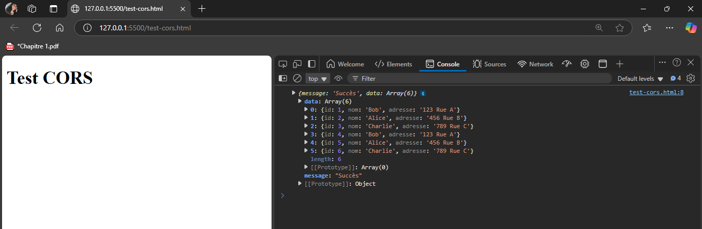
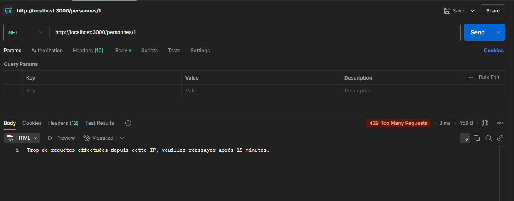

# TP2.5 : API RESTful avec CORS et Rate Limiting  
**Matière:** SoA et Microservices  
**Enseignant:** Dr. Salah Gontara  
**Classe:** 4Info  4Info  DataScience & AI 

**Auteur** : Naima REJEB

## 🎯 Objectifs  
- Autoriser les requêtes multi-origines (CORS) 🌐  
- Limiter les requêtes à 100/IP/15min (Rate Limiting) ⏳  

## 🛠️ Outils  
`Node.js` · `Express` · `SQLite3` · `cors` · `express-rate-limit`  

## 📝 Étapes du TP

### 1. 📥 Installation des Dépendances
```bash
npm install express sqlite3 cors express-rate-limit
```

## 2. ⚙️ Configuration (extrait du `index.js`)  


```javascript
const express = require('express');
const cors = require('cors');
const rateLimit = require('express-rate-limit');
const db = require('./database');
const app = express();
const PORT = 3000;

// Middleware pour parser le JSON
app.use(express.json());

// Configuration CORS
app.use(cors());

// Configuration du Rate Limiting
const limiter = rateLimit({
    windowMs: 15 * 60 * 1000, // 15 minutes
    max: 100, // Limite chaque IP à 100 requêtes par fenêtre
    message: 'Trop de requêtes effectuées depuis cette IP, veuillez réessayer après 15 minutes.'
});
app.use(limiter);

// Routes de l'API
app.get('/', (req, res) => {
    res.json("Registre de personnes! Choisissez le bon routage!");
});

// LES RESTES DU ROUTES 

// Démarrer le serveur
app.listen(PORT, () => {
    console.log(`Server running on port ${PORT}`);
}); 
```

## 2. 🧪 Test de l'implémentation

**Test de CORS**
* test-cors.html  
```html
<!DOCTYPE html>
<html>
<body>
    <h1>Test CORS</h1>
    <script>
        fetch('http://localhost:3000/personnes')
            .then(response => response.json())
            .then(data => console.log(data))
            .catch(error => console.error(error));
    </script>
</body>
</html>
```

Lorsqu'on ouvre ce fichier dans un Navigateur : 


**Test de Rate Limiting**

On va Utiliser Postman pour envoyer plus de 100 requêtes en moins de 15 minutes. 🚀
Un message d'erreur va apparaître 




## 📂 Structure du Projet
```plain text
TP2.5/
├── node_modules/                # Dossier des dépendances 📦
├── test_screenshots/            # Dossier contenant les images pour le README 🖼️
│   ├── test_cors.png            # Capture d'écran de la console (test CORS)🖥️
│   └── test_rate_Limiting.png   # Capture d'écran de Postman (test Rate Limiting)📨
├── database.js                  # Configuration de la base de données SQLite 🗄️
├── index.js                     # Fichier principal de l'API 🚀
├── test-cors.html               # Fichier pour le test CORS 🗺️
├── package.json                 # Fichier de configuration du projet 📄
├── README.md                    # Documentation du projet 📖
└── maBaseDeDonnees.sqlite       # Fichier de la base de données SQLite 🗃️
```
## 🚀 Comment Exécuter le Projet
Clonez le dépôt ou téléchargez les fichiers. 📥

1- Installez les dépendances :

```bash
npm install 
```
2- Démarrez le serveur :
```bash
node index.js
```
3- Accédez à l'API via http://localhost:3000. 🌐
