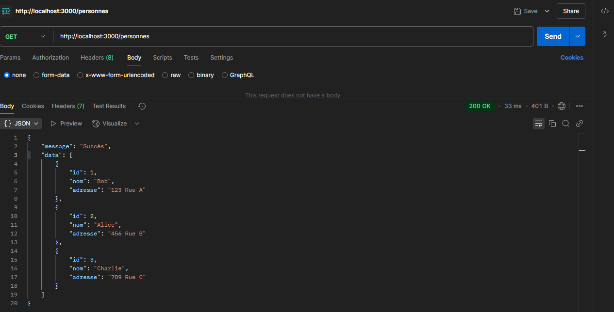
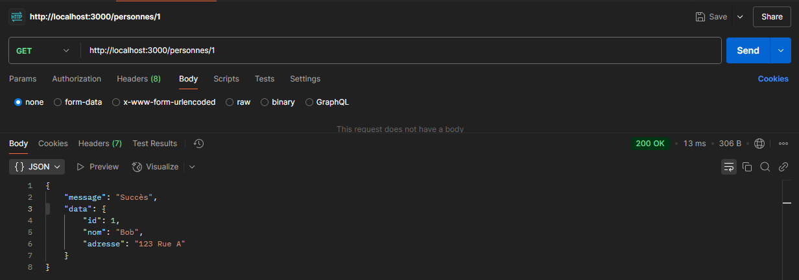
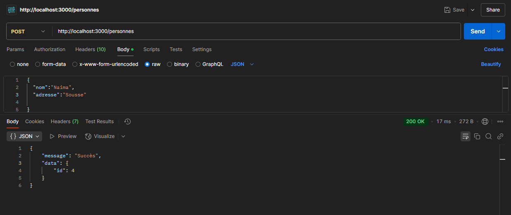
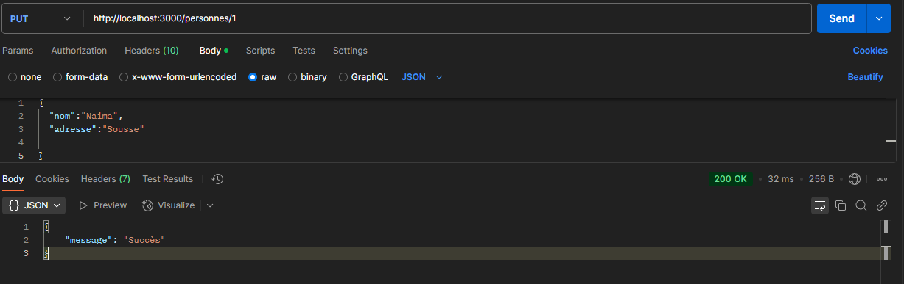
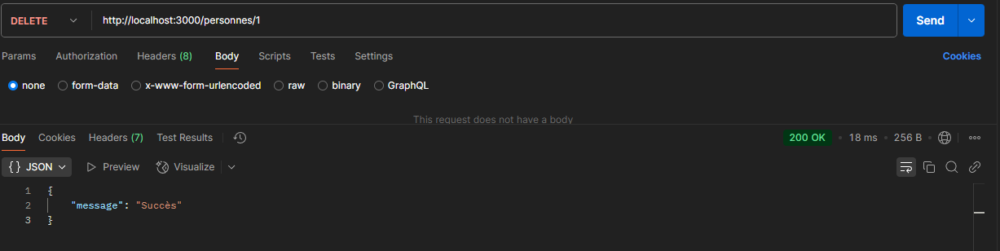

# TP2 : API Restful avec Express JS & SQLite


**Matière** : SoA & Microservices  
**Enseignant** : Dr. Salah Gontara  
**Classe** : 4Info  
**Auteur** : [Naima REJEB]  

---
## 📋 Objectifs
- Créer une API REST avec Express.js
- Utiliser les bonnes pratiques pour les API Restful
- Manipuler une base de données SQLite

## 🛠 Outils utilisés
- Node.js
- Express.js
- SQLite3
- Postman (pour les tests)

---

## 🚀 Étape 1 : Initialisation du Projet

```bash
mkdir tp2-api-restful
cd tp2-api-restful
npm init -y
npm install express sqlite3 

```

## 🗄 Étape 2 : Configuration de SQLite3

database.js (version initiale) : 

```bash
const sqlite3 = require('sqlite3').verbose(); 
// Connexion à la base de données SQLite 
const db = new sqlite3.Database('./maBaseDeDonnees.sqlite', sqlite3.OPEN_READWRITE | 
sqlite3.OPEN_CREATE, (err) => { 
if (err) { 
console.error(err.message); 
} else { 
console.log('Connecté à la base de données SQLite.'); 
db.run(`CREATE TABLE IF NOT EXISTS personnes ( 
id INTEGER PRIMARY KEY AUTOINCREMENT, 
nom TEXT NOT NULL 
)`, (err) => { 
if (err) { 
console.error(err.message); 
} else { 
// Insertion de données initiales 
const personnes = ['Bob', 'Alice', 'Charlie']; 
personnes.forEach((nom) => { 
db.run(`INSERT INTO personnes (nom) VALUES (?)`, [nom]); 
}); 
} 
}); 
} 
}); 
module.exports = db; 

```


## 🌐 Etape 3 : Mise en Place de l'API

index.js (version initiale) :

```bash
const express = require('express'); 
const db = require('./database'); 
const app = express(); 
app.use(express.json()); 
const PORT = 3000; 
app.get('/', (req, res) => { 
    res.json("Registre de personnes! Choisissez le bon routage!") 
}) 
// Récupérer toutes les personnes 
app.get('/personnes', (req, res) => { 
    db.all("SELECT * FROM personnes", [], (err, rows) => { 
        if (err) { 
            res.status(400).json({ 
                "error": err.message 
            }); 
            return; 
        } 
        res.json({ 
            "message": "success", 
            "data": rows 
        }); 
    }); 
}); 
 
 // Récupérer une personne par ID 
app.get('/personnes/:id', (req, res) => { 
    const id = req.params.id; 
    db.get("SELECT * FROM personnes WHERE id = ?", [id], (err, row) => { 
        if (err) { 
            res.status(400).json({ 
                "error": err.message 
            }); 
            return;        } 
        res.json({ 
            "message": "success", 
            "data": row        }); 
    }); 
}); 
// Créer une nouvelle personne 
app.post('/personnes', (req, res) => { 
    const nom = req.body.nom; 
    db.run(`INSERT INTO personnes (nom) VALUES (?)`, [nom], function(err) { 
        if (err) { 
            res.status(400).json({ 
                "error": err.message 
            }); 
            return;        } 
        res.json({ 
            "message": "success", 
            "data": { 
                id: this.lastID            } 
        }); 
    }); 
}); 

  // Mettre à jour une personne 
app.put('/personnes/:id', (req, res) => { 
    const id = req.params.id; 
    const nom = req.body.nom; 
    db.run(`UPDATE personnes SET nom = ? WHERE id = ?`, [nom, id], function(err) { 
        if (err) { 
            res.status(400).json({ 
                "error": err.message 
            }); 
            return;        } 
        res.json({ 
            "message": "success" 
        }); 
    }); 
}); 
// Supprimer une personne 
app.delete('/personnes/:id', (req, res) => { 
    const id = req.params.id; 
    db.run(`DELETE FROM personnes WHERE id = ?`, id, function(err) { 
        if (err) { 
            res.status(400).json({ 
                "error": err.message 
            }); 
            return; 
        } 
        res.json({ 
            "message": "success" }); 
    }); 
}); 
 
app.listen(PORT, () => {console.log(`Server running on port ${PORT}`);  });
```

## 🔧 Étape 4 : Modification de la Structure de la Base

database.js (nouvelle version)

```bash
const sqlite3 = require('sqlite3').verbose(); 
// Connexion à la base de données SQLite 
const db = new sqlite3.Database('./maBaseDeDonnees.sqlite', sqlite3.OPEN_READWRITE | sqlite3.OPEN_CREATE, (err) => { 
if (err) { 
console.error(err.message); 
} else { 
console.log('Connecté à la base de données SQLite.'); 
db.run(`CREATE TABLE IF NOT EXISTS personnes ( 
    id INTEGER PRIMARY KEY AUTOINCREMENT, 
    nom TEXT NOT NULL,
    adresse TEXT 
    )`, (err) => { 
    if (err) { 
    console.error(err.message); 
    } else { 
    // Insertion de données initiales avec adresses
    const personnes = [
        {nom: 'Bob', adresse: '123 Rue A'},
        {nom: 'Alice', adresse: '456 Rue B'},
        {nom: 'Charlie', adresse: '789 Rue C'},
    ]; 
personnes.forEach((personne) => { 
db.run(`INSERT INTO personnes (nom,adresse) VALUES (?,?)`, [personne.nom,personne.adresse], (err) => {
    if (err) { 
        console.error('Erreur d\'insertion' , err.message); 
    }
}); 
});
    }
});
}
});
module.exports = db;

```
index.js (nouvelle version) : 

```bash

const express = require('express'); 
const db = require('./database.js'); 
app.use(express.json()); 
app.get('/', (req,res)=>{ 
    res.json("Registre des personnes ! Choisissez le bon routage ! ") // Route de base
})

// Route pour récupérer toutes les personnes
app.get('/personnes', (req,res) =>{
    db.all(`SELECT * FROM personnes`, [], (err,rows) =>{ 
        if (err){
            res.status(400).json({ 
                "error": err.message
            });
            return; 
        }
        res.json({ 
            "message": "Succès",
            "data": rows
        });
    });
});

// Route pour récupérer une personne par son ID
app.get('/personnes/:id', (req,res) => {
    const id = req.params.id; 
    db.get(`SELECT * FROM personnes WHERE id=?`,[id], (err,row) => {
        if(err){
            res.status(400).json({
                "error": err.message
            });
            return;
        }
        res.json({
            "message": "Succès",
            "data": row
        });
    });
}); 

// Route pour ajouter une nouvelle personne
app.post('/personnes',(req,res)=>{
    const {nom, adresse}= req.body; 
    db.run(`INSERT INTO personnes (nom,adresse) VALUES (?,?)`, [nom,adresse], function(err){
        if(err){
            res.status(400).json({
                "error":err.message
            });
            return;
        }
        res.json({
            "message": "Succès",
            "data": {
                id: this.lastID, // ID de la dernière insertion
        }});
});
});

// Route pour mettre à jour une personne par son ID
app.put('/personnes/:id', (req,res) => {
    const id = req.params.id; 
    const {nom, adresse}=req.body;
    db.run(`UPDATE personnes SET nom= ? , adresse=? WHERE id = ? `, [nom,adresse, id], function(err){
        if(err){
            res.status(400).json({
                "error" : err.message
            });
            return;
            }
            // Vérifier si une ligne est mis à jour 
            if(this.changes === 0){
                res.status(404).json({
                    "message": "Personne non trouvée"
                });
                return;
                }
        res.json({
            "message":"Succès"
        });
        });
        });

// Route pour supprimer une personne par son ID
app.delete('/personnes/:id', (req, res)=>{
    const id = req.params.id;
    db.run(`DELETE FROM personnes WHERE id = ?`,[id], function(err){
        if(err){
            res.status(400).json({
                "error": err.message
            });
            return;
        }
        res.json({
            "message": "Succès"
        });
    });
}); 

// Démarrer le serveur
app.listen(PORT, () => {
    console.log(`Le serveur écoute sur le port ${PORT}`); 
});

```
## 🧪 Étape 5 : Test avec Postman

- **GET /personnes** 
- **GET /personnes/{id}** 
- **POST /personnes/{id}** 
- **PUT /personnes/{id}** 
- **DELETE /personnes/{id}** 


## 🔒 Étape 6 : OAuth 2.0 avec Keycloak

En cours .

---

### 📂 Structure du Projet

```plaintext
TP2/
├── node_modules/          # Dépendances 📦
├── postman_screenshots/                   # Images pour le README 🖼️
├── database.js            # Base de données SQLite 🗄️
├── index.js               # API principale 🚀
├── keycloak-config.json   # Configuration de Keycloak 🔐
├── package.json           # Configuration du projet 📄
├── README.md              # Documentation 📖
└── maBaseDeDonnees.sqlite # Base de données 🗃️
```

---

## 🚀 Comment Exécuter le Projet

1. Installez les dépendances :
   ```bash
   npm install
   ```
2. Démarrez le serveur :
   ```bash
   node index.js
   ```
3. Accédez à l'API via `http://localhost:3000`. 🌐