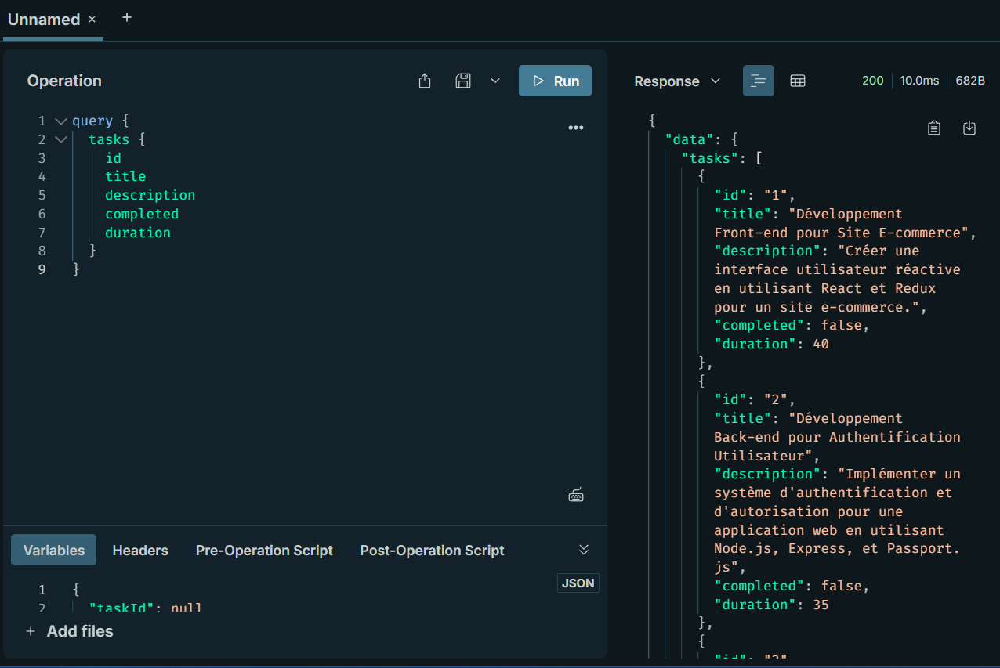
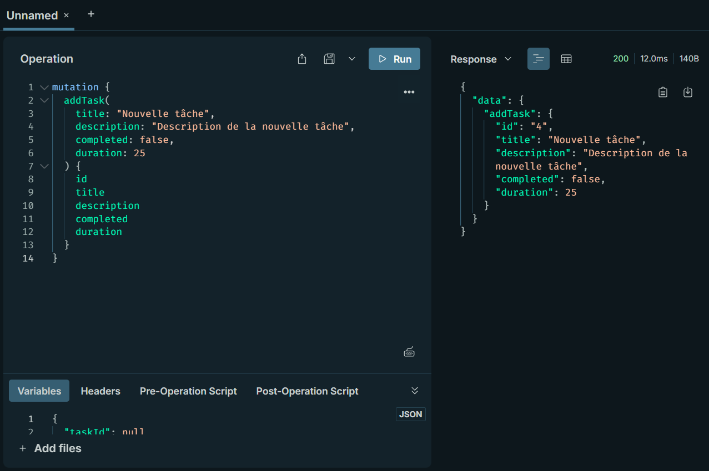
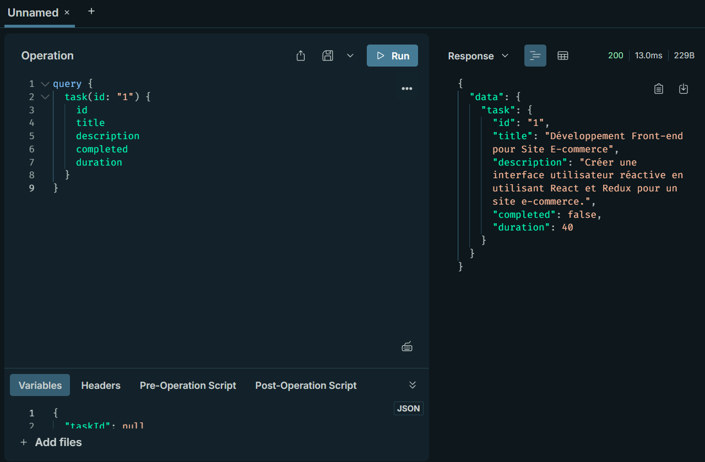
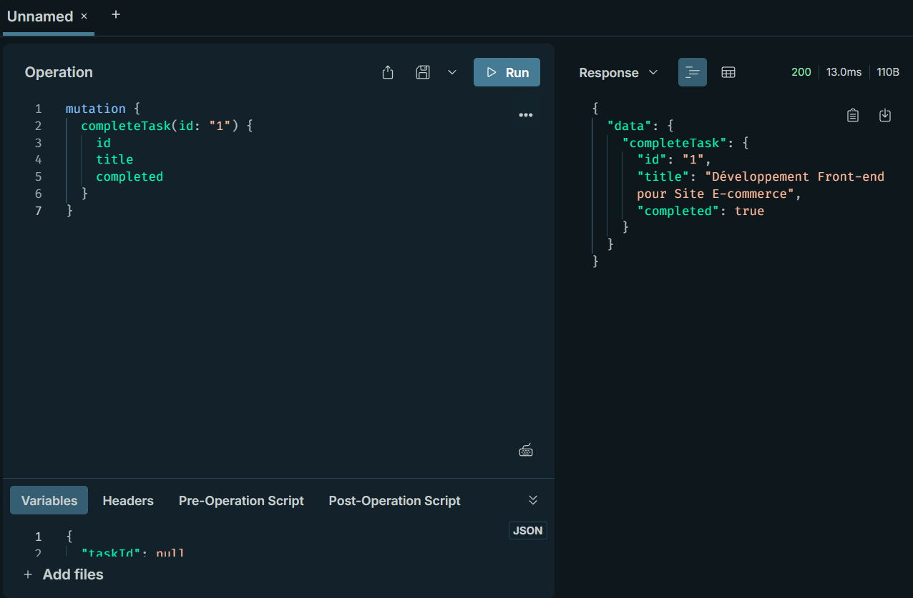
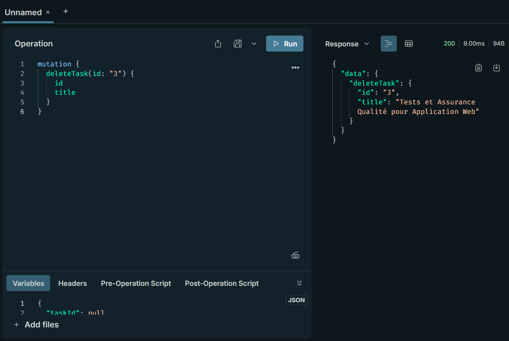

# TP3 : Système de gestion de tâches avec GraphQL 

**Matière** : SoA & Microservices  
**Enseignant** : Dr. Salah Gontara  
**Classe** : 4Info  DataScience & AI 

**Auteur** : Naima REJEB

---
## 📋 Objectifs
- Comprendre GraphQL (Schémas, Résolveurs, Queries/Mutations)  
- Implémenter un CRUD complet avec GraphQL  
- Utiliser Apollo Server et GraphQL Sandbox  

## 🛠 Outils utilisés
- `Node.js` · `GraphQL` · `Apollo Server` · `express`  

---
## 📝 Étapes du TP  

## 📥 Installation des Dépendances  
```bash  
npm install express @apollo/server body-parser @graphql-tools/schema graphql  
```
## 🚀 Étape 1 : Initialisation du Projet

```bash
mkdir tp3-graphql
cd tp3-graphql
npm init -y
npm install express @apollo/server graphql body-parser @graphql-tools/schema

```

## 🗄 Étape 2 : ⚙️ Configuration des Fichiers

*taskSchema.gql*

```bash
type Task {
id: ID!
title: String!
description: String!
completed: Boolean!
duration: Int!
}
type Query {
task(id: ID!): Task
tasks: [Task]
}
type Mutation {
addTask(title: String!, description: String!, completed: Boolean!,duration:Int!): Task
completeTask(id: ID!): Task
changeDescription(id: ID!, description: String!): Task
deleteTask(id: ID!): Task
}
```
*taskSchema.js*

```bash
const fs = require('fs');
const path = require('path');
const { buildSchema } = require('graphql');
const { promisify } = require('util');
const readFileAsync = promisify(fs.readFile);
async function getTaskSchema() {
const schemaPath = path.join(__dirname, 'taskSchema.gql');
try {
const schemaString = await readFileAsync(schemaPath, { encoding: 'utf8'
});
return buildSchema(schemaString);
} catch (error) {
console.error("Error reading the schema file:", error);
throw error;
}
}
module.exports = getTaskSchema();
```
*taskResolver.js*

```bash
let tasks = [
{
    id: '1',
    title: 'Développement Front-end pour Site E-commerce',
    description: 'Créer une interface utilisateur réactive en utilisant React et Redux pour un site e-commerce.',
    completed: false,
    duration: 40, 
},
{
    id: '2',
    title: 'Développement Back-end pour Authentification Utilisateur',
    description: "Implémenter un système d'authentification et d'autorisation pour une application web en utilisant Node.js, Express, et Passport.js",
    completed: false,
    duration: 35,
},
{
    id: '3',
    title: 'Tests et Assurance Qualité pour Application Web',
    description: 'Développer et exécuter des plans de test et des cas de test complets.',
    completed: false,
    duration: 20,
},
];

const taskResolver = {
Query: {
    task: (_, { id }) => tasks.find(task => task.id === id),
    tasks: () => tasks,
},

Mutation: {
    addTask: (_, { title, description, completed, duration }) => {
    const task = {
        id: String(tasks.length + 1),
        title,
        description,
        completed,
        duration, 
    };
    tasks.push(task);
    return task;
    },
    completeTask: (_, { id }) => {
    const taskIndex = tasks.findIndex(task => task.id === id);
    if (taskIndex !== -1) {
        tasks[taskIndex].completed = true;
        return tasks[taskIndex];
    }
    return null;
    },
    changeDescription: (_, { id, description }) => {
    const taskIndex = tasks.findIndex(task => task.id === id);
    if (taskIndex !== -1) {
        tasks[taskIndex].description = description;
        return tasks[taskIndex];
    }
    return null;
    },
    deleteTask: (_, { id }) => {
    const taskIndex = tasks.findIndex(task => task.id === id);
    if (taskIndex !== -1) {
        const deletedTask = tasks.splice(taskIndex, 1)[0];
        return deletedTask;
    }
    return null;
    },
},
};

module.exports = taskResolver;


```
*index.js*

```bash
const express = require('express');
const { ApolloServer } = require('@apollo/server');
const { expressMiddleware } = require('@apollo/server/express4');
const { json } = require('body-parser');
const { addResolversToSchema } = require('@graphql-tools/schema');
const taskSchemaPromise = require('./taskSchema');
const taskResolver = require('./taskResolver');
const app = express();
async function setupServer() {
try {
const taskSchema = await taskSchemaPromise;
const schemaWithResolvers = addResolversToSchema({
schema: taskSchema,
resolvers: taskResolver,
});
const server = new ApolloServer({
schema: schemaWithResolvers,
});
await server.start();
app.use(
'/graphql',
json(),
expressMiddleware(server)
);
const PORT = process.env.PORT || 5000;
app.listen(PORT, () => console.log(`Server started on port ${PORT}`));
} catch (error) {
console.error('Failed to start the Apollo server:', error);
}
}
setupServer();

```

## 🔧 Modifications  Effectuées (selon l'énoncé du TP)
1. Ajout du champ duration au type Task
2. Ajout de la mutation deleteTask pour supprimer une tâche
3. Créer des requêtes GraphQL pour : Récupérer toutes les tâches, Ajouter une nouvelle tâche, Marquer une tâche comme terminée.
4.  Ajouter une mutation changeDescription pour changer la description de la tâche au schéma et au résolveur. 
5. Ajouter également une mutation deleteTask pour effacer une tâche par son id.

## 🧪 Comment Exécuter le Projet 

1. Installez les dépendances :
   ```bash
   npm install
   ```
2. Démarrez le serveur :
   ```bash
   node index.js
   ```
3. Accédez à l'interface GraphQL via `http://localhost:5000/graphql`. 🌐
4. Tester les requêtes dans Apollo Studio Sandbox : 
   * **Récupérer toutes les tâches**
   ```bash
    query {
        tasks {
            id
            title
            description
            completed
            duration
            }
            }
   ```
   
   * **Ajouter une nouvelle tâche**
    ```bash
    mutation {
        addTask(
            title: "Nouvelle tâche",
            description: "Description de la nouvelle tâche",
            completed: false,
            duration: 25
        ) {
            id
            title
            description
            completed
            duration
        }
        }
   ```
   
   * **Récupérer une tâche spécifique**
    ```bash
    query {
        task(id: "1") {
            id
            title
            description
            completed
            duration
        }
    }
   ```
   
   * **Marquer une tâche comme terminée**
  ```bash
        mutation {
        completeTask(id: "1") {
            id
            title
            completed
        }
    }
   ```
   
   * **Modifier la desscription d'une tâche**
    ```bash
    mutation {
        changeDescription(
            id: "2", 
            description: "Nouvelle description mise à jour"
        ) {
            id
            title
            description
        }
    }
   ```
   
   * **Supprimer une tâche**
   ```bash
    mutation {
        deleteTask(id: "3") {
            id
            title
    }
    }
   ```
    


### 📂 Structure du Projet

```plaintext
TP3/
├── node_modules/          # Dépendances 📦 (@apollo/server, graphql, express)
├── taskSchema.gql         # Définition des types GraphQL 📜
├── taskSchema.js          # Chargeur de schéma 🔄 
├── taskResolver.js        # Logique métier des résolveurs 🧩
├── index.js               # Serveur Apollo principal 🚀
├── package.json           # Configuration du projet ⚙️
└── README.md              # Documentation 📖
```

---

