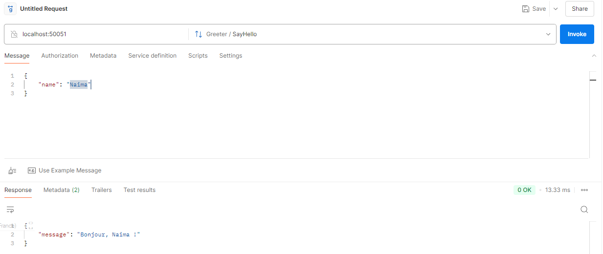

# TP4 - Introduction à gRPC


**Matière** : SoA & Microservices  
**Enseignant** : Dr. Salah Gontara  
**Classe** : 4Info  DataScience & AI 

**Auteur** : Naima REJEB

---

## 📌 Objectifs
- Implémenter un service gRPC avec NodeJS
- Comprendre le fonctionnement de Protocol Buffers (Protobuf)
- Tester le service avec Postman

---

## 🛠️ Prérequis
- [Node.js](https://nodejs.org/) (v18+ recommandé)
- [ProtoBuf](https://developers.google.com/protocol-buffers/docs/downloads) 
   ```bash
   # Sur Windows : Télécharger depuis https://protobuf.dev/downloads/
   # Sur Ubuntu :
   sudo snap install protobuf --classic
    ```
- [Postman](https://www.postman.com/) 
- Un terminal (PowerShell, CMD ou WSL sur Windows)

---

## ⚙️ Outils Utilisés
- Node.js
- Protocol Buffers (protobuf)
- gRPC
- protoLoader
- Postman (pour les tests)


---
## 📝 Étapes du TP  

## 📥 Configuration du TP  
```bash  
mkdir TP4_gRPC
cd TP4_gRPC
npm init -y
npm install @grpc/grpc-js @grpc/proto-loader 
```
### ⚙️ Configuration des Fichiers*

*hello.proto*

```plaintext
syntax = "proto3";
package hello;

service Greeter {
    rpc SayHello (HelloRequest) returns (HelloReply) {}
}

message HelloRequest {
    string name = 1;
}

message HelloReply {
    string message = 1;
}
```

*server.js*

```bash  
const grpc = require('@grpc/grpc-js');
const protoloader = require('@grpc/proto-loader');
const path = require('path');

const PROTO_PATH = path.join(__dirname, 'hello.proto');

const packageDefinition = protoloader.loadSync(PROTO_PATH, {
    keepCase: true,
    longs: String,
    enums: String,
    defaults: true,
    oneofs: true
});
const helloProto = grpc.loadPackageDefinition(packageDefinition).hello; // loadPackageDefinition est une fonction synchrone qui renvoie un objet contenant les définitions de tous les services et messages définis dans le fichier .proto pour le package hello.

function sayHello(call, callback) {
    const { name } = call.request;
    const reply = { message: `Bonjour, ${name} !` }; 
    callback(null, reply);
}

function main() {
    const server = new grpc.Server();
    server.addService(helloProto.Greeter.service, {
        SayHello: sayHello
    });
    const port = '0.0.0.0:50051';
    server.bindAsync(port, grpc.ServerCredentials.createInsecure(), () => {
        console.log(`Serveur gRPC démarré sur ${port}`); 
    });
}
main();

```

## 🧪 Comment Exécuter le TP

1. Installez les dépendances :
   ```bash
   npm install
   ```
2. Démarrez le serveur :
   ```bash
   node server.js
   ```
   - Sortie attendue : 
   ```plaintext 
   Serveur gRPC démarré sur 0.0.0.0:50051
    ```
3. Tester avec Postman :
   1. - Importer le fichier hello.proto
   2. - Configurer une requête gRPC vers localhost:50051
   3. - Appeler la méthode SayHello avec le payload : 
   ```bash 
   { "name": "VotreNom" }
   ```

   

### 📂 Structure du Projet

```plaintext
             
TP4_GRPC/
├── node_modules/        # Dépendances 📦
├── test_postman/        # Les captures du test 📜
├── hello.proto          # Définition du service gRPC 🧩
├── server.js            # Implémentation du serveur 🚀
├── package.json         # Configuration du projet ⚙️
└── README.md            # Documentation 📖


```