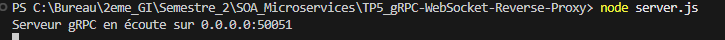
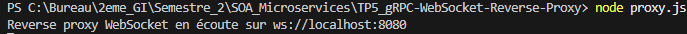
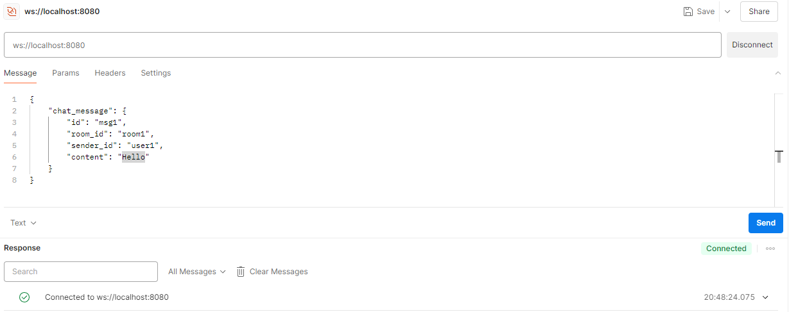
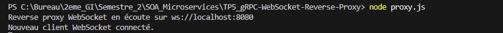
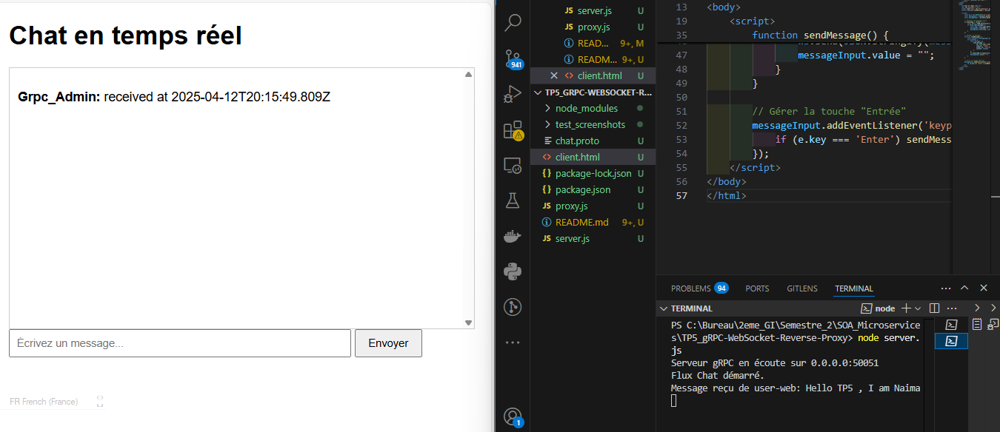
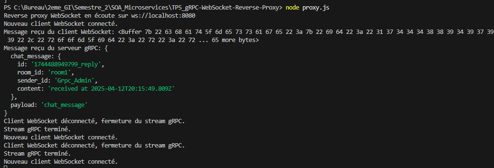

# TP5 - Reverse Proxy WebSocket avec microservice gRPC


**Matière** : SoA & Microservices  
**Enseignant** : Dr. Salah Gontara  
**Classe** : 4Info  DataScience & AI 

**Auteur** : Naima REJEB

---

## 📌 Objectifs
- Implémenter un service de chat avec gRPC et WebSocket
- Comprendre le rôle d'un reverse proxy
- Maîtriser le streaming bidirectionnel
- Tester le système avec Postman et un client web

---
## 🛠️ Prérequis
- [Node.js](https://nodejs.org/) (v18+ recommandé)
- [Protobuf Compiler](https://grpc.io/docs/protoc-installation/) 
- ```bash
   # Sur Windows : Télécharger depuis https://grpc.io/docs/protoc-installation/
   # Sur Ubuntu :
   sudo apt install protobuf-compiler
    ```
- [Postman](https://www.postman.com/) 

---

## ⚙️ Outils Utilisés
- Node.js
- gRPC (@grpc/grpc-js)
- WebSocket (ws)
- Protocol Buffers
- Postman
---

## 📝 Étapes du TP  

## 📥 Configuration du TP  
```bash  
mkdir TP5_gRPC-WebSocket-Reverse-Proxy
cd TP5_gRPC-WebSocket-Reverse-Proxy
npm init -y
npm install @grpc/grpc-js @grpc/proto-loader ws
```

### ⚙️ Configuration des Fichiers

*chat.proto*
```plaintext
syntax = "proto3";
package chat;
// Définition d'une énumération pour représenter le statut d'un utilisateur
enum UserStatus {
 UNKNOWN = 0; // Statut inconnu (valeur par défaut)
 ACTIVE = 1; // Utilisateur actif
 INACTIVE = 2; // Utilisateur inactif
}
// Message représentant un utilisateur
message User {
 string id = 1; // Identifiant unique de l'utilisateur
 string name = 2; // Nom de l'utilisateur
 string email = 3; // Adresse email
 UserStatus status = 4; // Statut de l'utilisateur (valeurs définies dans l'enum)
}
// Message représentant un message de chat
message ChatMessage {
 string id = 1; // Identifiant du message
 string room_id = 2; // Identifiant de la salle de chat
 string sender_id = 3; // Identifiant de l'expéditeur
 string content = 4; // Contenu du message
}
// Message de requête pour récupérer un utilisateur
message GetUserRequest {
 string user_id = 1; // Identifiant de l'utilisateur à récupérer
}
// Message de réponse contenant les informations d'un utilisateur
message GetUserResponse {
 User user = 1; // L'utilisateur correspondant à la requête
}
// Message utilisé pour le streaming de chat.
// L'utilisation de "oneof" permet d'étendre le schéma en ajoutant d'autres types d'événements ultérieurement.
message ChatStream {
 oneof payload {
 ChatMessage chat_message = 1; // Un message de chat
 }
}
// Définition du service gRPC avec deux méthodes :
// - GetUser pour obtenir les infos d'un utilisateur
// - Chat pour le streaming bidirectionnel de messages de chat
service ChatService {
 rpc GetUser(GetUserRequest) returns (GetUserResponse);
 rpc Chat(stream ChatStream) returns (stream ChatStream);
}
```

*server.js*

```bash  
const grpc = require('@grpc/grpc-js');
const protoLoader = require('@grpc/proto-loader');
const path = require('path');
// Chemin vers le fichier proto
const PROTO_PATH = path.join(__dirname, 'chat.proto');
// Chargement du fichier proto
const packageDefinition = protoLoader.loadSync(PROTO_PATH, {
keepCase: true,
longs: String,
enums: String,
defaults: true,
oneofs: true,
});
const chatProto = grpc.loadPackageDefinition(packageDefinition).chat;
// Définition d'un utilisateur administrateur de base
const admin = {
id: "admin",
name: "Grpc_Admin",
email: "grpc_admin@mail.com",
status: "ACTIVE",
};
// Implémentation de l'appel GetUser
function getUser(call, callback) {
    const userId = call.request.user_id; 
    console.log(`Requête GetUser reçue pour id: ${userId}`);
    // Retourner un utilisateur fictif en se basant sur "admin" et en remplaçantl'id par celui fourni
    const user = { ...admin, id: userId };
    callback(null, { user });
}

// Implémentation de l'appel Chat (streaming bidirectionnel)
function chat(call) {
    console.log("Flux Chat démarré.");
    call.on('data', (chatStreamMessage) => {
    if (chatStreamMessage.chat_message) {
    const msg = chatStreamMessage.chat_message;
    console.log(`Message reçu de ${msg.sender_id}: ${msg.content}`);
    // Création d'une réponse avec quelques modifications sur le message reçu
    const reply = {
    id: msg.id + "_reply",
    room_id: msg.room_id,
    sender_id: admin.name,
    content: "received at " + new Date().toISOString(),
    };
    // On renvoie le message au client (écho)
    call.write({ chat_message: reply });
    } 
    });
    call.on('end', () => {
    console.log("Fin du flux Chat.");
    call.end();
    });
}
// Démarrage du serveur gRPC
function main() {
const server = new grpc.Server();
server.addService(chatProto.ChatService.service, {
GetUser: getUser,
Chat: chat,
});
const address = '0.0.0.0:50051';
server.bindAsync(address, grpc.ServerCredentials.createInsecure(), (error,
port) => {
if (error) {
console.error("Erreur lors du binding du serveur :", error);
return;
}
console.log(`Serveur gRPC en écoute sur ${address}`);
});
}
main();
```

*proxy.js*

```javascript
const grpc = require('@grpc/grpc-js');
const protoLoader = require('@grpc/proto-loader');
const WebSocket = require('ws');
const path = require('path');
// Chemin vers le fichier proto
const PROTO_PATH = path.join(__dirname, 'chat.proto');
// Chargement du fichier proto
const packageDefinition = protoLoader.loadSync(PROTO_PATH, {
keepCase: true,
longs: String,
enums: String,
defaults: true,
oneofs: true,
});
const chatProto = grpc.loadPackageDefinition(packageDefinition).chat;
// Fonction pour créer un client gRPC
function createGrpcClient() {
return new chatProto.ChatService('localhost:50051',
grpc.credentials.createInsecure());
}
// Création d'un serveur WebSocket servant de reverse proxy
const wss = new WebSocket.Server({ port: 8080 });
console.log('Reverse proxy WebSocket en écoute sur ws://localhost:8080');
wss.on('connection', (ws) => {
console.log('Nouveau client WebSocket connecté.');
// Pour chaque client, créer un stream gRPC bidirectionnel
const grpcClient = createGrpcClient();
const grpcStream = grpcClient.Chat();
// Relayer les messages reçus du serveur gRPC vers le client WebSocket
grpcStream.on('data', (chatStreamMessage) => {
console.log('Message reçu du serveur gRPC:', chatStreamMessage);
ws.send(JSON.stringify(chatStreamMessage));
});
grpcStream.on('error', (err) => {
console.error('Erreur dans le stream gRPC:', err);
ws.send(JSON.stringify({ error: err.message }));
});
grpcStream.on('end', () => {
console.log('Stream gRPC terminé.');
ws.close();
});
// Relayer les messages reçus du client WebSocket vers le serveur gRPC
ws.on('message', (message) => {
    console.log('Message reçu du client WebSocket:', message);
    try {
    const parsed = JSON.parse(message);
    grpcStream.write(parsed);
    } catch (err) {
    console.error('Erreur lors de la conversion du message JSON:', err);
    ws.send(JSON.stringify({ error: 'Format JSON invalide' }));
    }
    });
    ws.on('close', () => {
    console.log('Client WebSocket déconnecté, fermeture du stream gRPC.');
    grpcStream.end();
    });
    });
```
## 🧪 Première Exécution et Test 

1. Installez les dépendances :
   ```bash
   npm install
   ```
2. Démarrez le serveur :
   ```bash
   node server.js
   ```
   - Sortie attendue :
    ```plaintext 
    Serveur gRPC démarré sur 0.0.0.0:50051 ```
3. Démarrer le reverse proxy: 
   ```bash
   node proxy.js
   ```
   - Sortie attendue :
   ```plaintext 
    Reverse proxy WebSocket en écoute sur wss://localhost:8080 ```
4. Tester avec Postman :
   1. - Se connecter à : ws://localhost:8080
   2. - Envoyer ce message json : 
   ```bash 
   {
    "chat_message": {
        "id": "msg1",
        "room_id": "room1",
        "sender_id": "user1",
        "content": "Hello"
    }

   ```

   
   
*  Test sur Postman : 
   
   
---

## ⚙️ Travail à faire :  Ajout de l'Historique des Messages

*chat.proto*
On ajoute : 
```bash 
// Message pour demander l'historique
message GetChatHistoryRequest {
    string room_id = 1;  // Identifiant de la salle de chat
    int32 max_messages = 2;  // Nombre max de messages à récupérer
}

// Message pour retourner l'historique
message GetChatHistoryResponse {
    repeated ChatMessage messages = 1;  // Liste des messages
}

// Mettre à jour le service ChatService
service ChatService {
    rpc GetUser(GetUserRequest) returns (GetUserResponse);
    rpc Chat(stream ChatStream) returns (stream ChatStream);
    rpc GetChatHistory(GetChatHistoryRequest) returns (GetChatHistoryResponse); // Nouvelle méthode
}
```


*server.js*
On le modifie de cette façon : 
```bash 
// En haut du fichier (après les imports)
const chatHistory = []; // Stocke tous les messages

// Nouvelle méthode GetChatHistory
function getChatHistory(call, callback) {
    const { room_id, max_messages } = call.request;
    const filteredMessages = chatHistory
        .filter(msg => msg.room_id === room_id)
        .slice(-max_messages); // Récupère les N derniers messages

    callback(null, { messages: filteredMessages });
}

// Mettre à jour la méthode Chat pour stocker les messages
function chat(call) {
    call.on('data', (chatStreamMessage) => {
        if (chatStreamMessage.chat_message) {
            const msg = chatStreamMessage.chat_message;
            chatHistory.push(msg); // Stocke le message dans l'historique
            // ... (reste du code existant)
        }
    });
    // ... (reste du code existant)
}

// Mettre à jour la méthode main() pour inclure la nouvelle méthode
function main() {
    const server = new grpc.Server();
    server.addService(chatProto.ChatService.service, {
        GetUser: getUser,
        Chat: chat,
        GetChatHistory: getChatHistory, // Nouvelle méthode
    });
    // ... (reste du code existant)
}
```

## 🚀 Création d'un Client Web Minimal

*client.html*
```bash
<!DOCTYPE html>
<html lang="fr">
<head>
    <meta charset="UTF-8">
    <title>Client Chat WebSocket</title>
    <style>
        body { font-family: Arial, sans-serif; margin: 20px; }
        #messages { height: 300px; border: 1px solid #ccc; overflow-y: scroll; padding: 10px; }
        #messageInput { width: 70%; padding: 8px; }
        button { padding: 8px 15px; }
    </style>
</head>
<body>
    <h1>Chat en temps réel</h1>
    <div id="messages"></div>
    <input type="text" id="messageInput" placeholder="Écrivez un message..." />
    <button onclick="sendMessage()">Envoyer</button>

    <script>
        const ws = new WebSocket('ws://localhost:8080');
        const messagesDiv = document.getElementById('messages');
        const messageInput = document.getElementById('messageInput');

        // Afficher les messages reçus
        ws.onmessage = (event) => {
            const data = JSON.parse(event.data);
            if (data.chat_message) {
                const msg = data.chat_message;
                messagesDiv.innerHTML += `<p><strong>${msg.sender_id}:</strong> ${msg.content}</p>`;
                messagesDiv.scrollTop = messagesDiv.scrollHeight; // Défilement automatique
            }
        };

        // Envoyer un message
        function sendMessage() {
            const content = messageInput.value.trim();
            if (content) {
                const message = {
                    chat_message: {
                        id: Date.now().toString(),
                        room_id: "room1",
                        sender_id: "user-web",
                        content: content
                    }
                };
                ws.send(JSON.stringify(message));
                messageInput.value = "";
            }
        }

        // Gérer la touche "Entrée"
        messageInput.addEventListener('keypress', (e) => {
            if (e.key === 'Enter') sendMessage();
        });
    </script>
</body>
</html>
```
## Tester le client web 
  1. Lancer les serveurs :
   ```bash 
   node server.js  # Port 50051 (gRPC)
   node proxy.js   # Port 8080 (WebSocket)
```
  2. Ouvrir client.html dans un navigateur et tester l'envoi des messages en temps réel :
  - Tapez un message dans le champ de saisie et appuyez sur Envoyer 
  
  